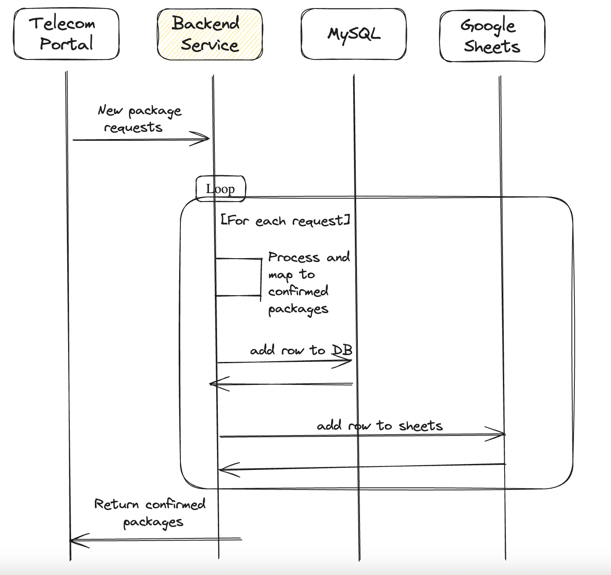
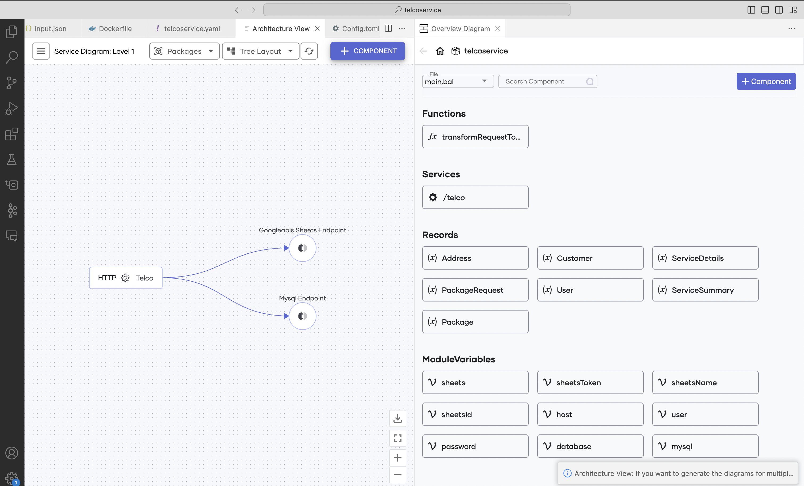
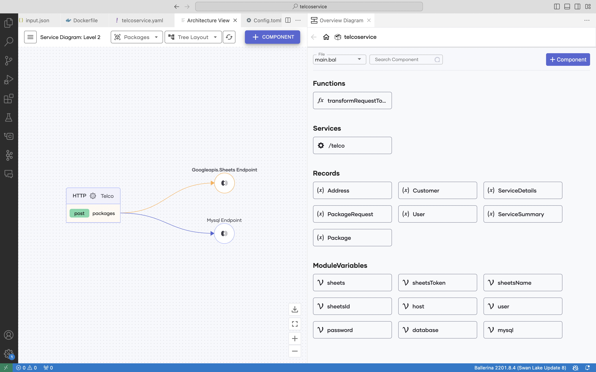
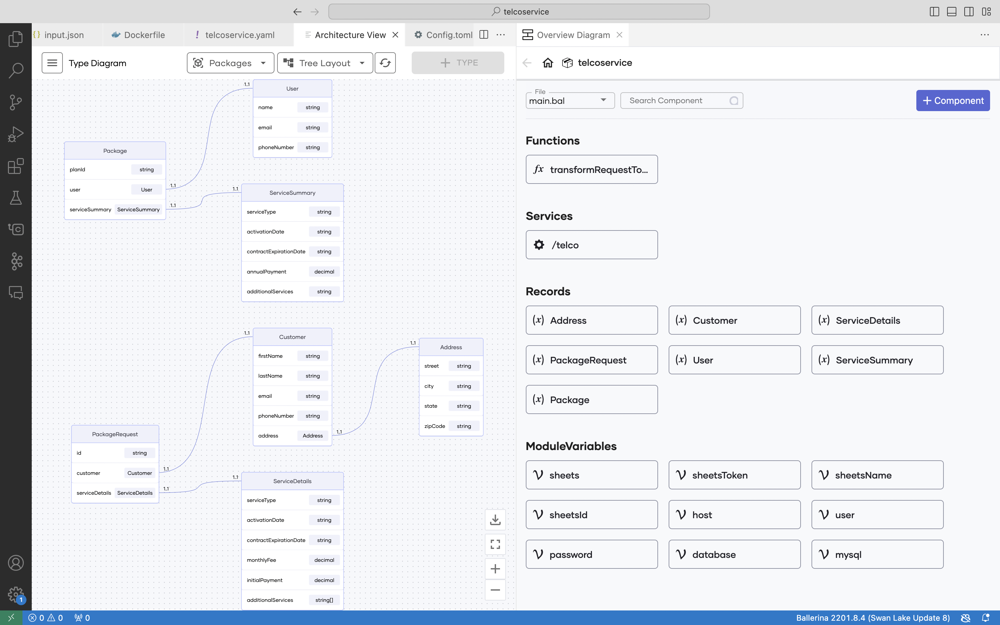
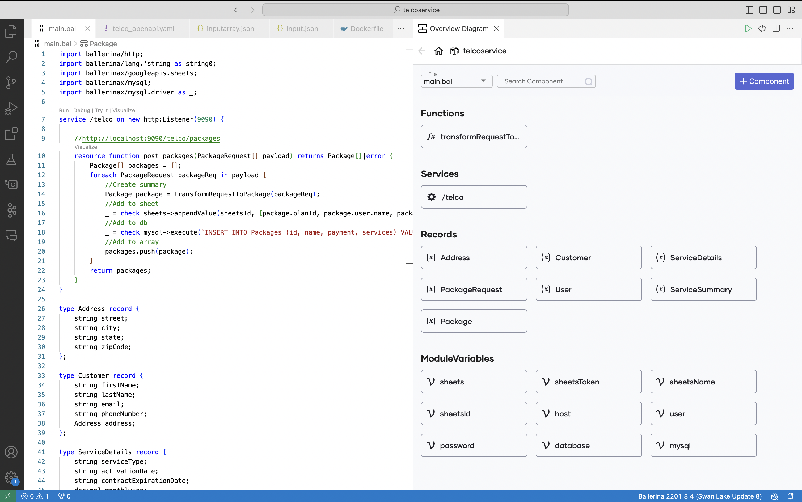
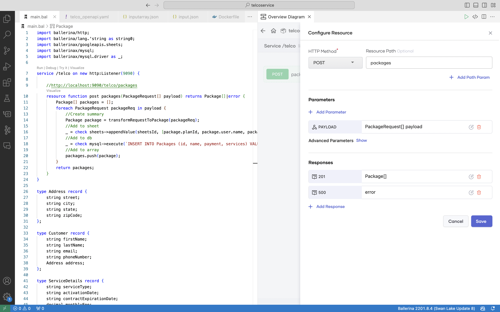
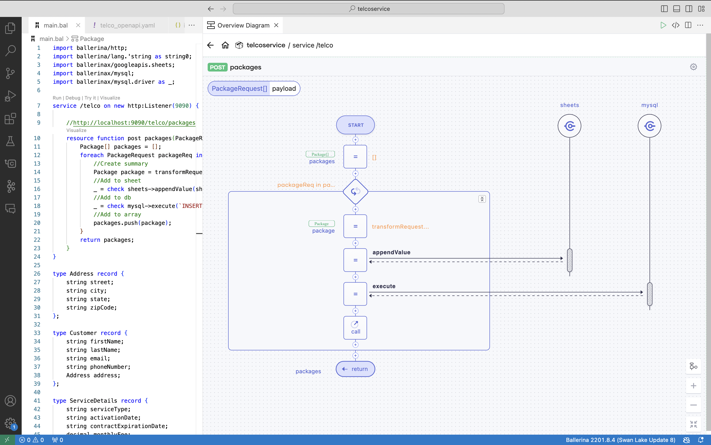
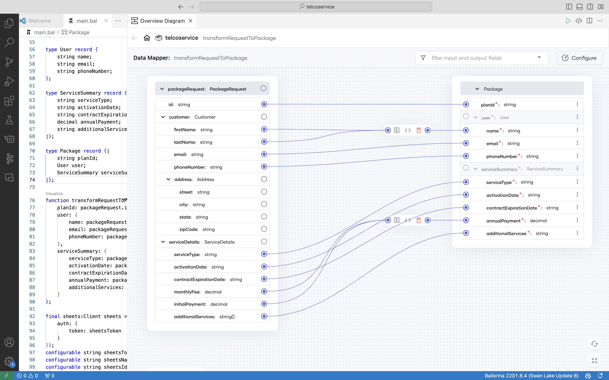

# Ballerina HTTP service for telecommunication data backend

This Ballerina-based HTTP service serves as the backend for an telecommunication service provider. It processes a JSON array containing new telecom package request details and performs the following tasks upon receipt:

1. Computes and transforms the input payload into the necessary output payload.
2. Utilizes OpenAI for risk analysis of the provided policy.
3. Updates a Google Sheet with the Plan ID, Customer Name, Annual Payment, and Additional Services.



## Prerequisites

### Ballerina 
1. Download and install [Ballerina Swan Lake](https://ballerina.io/downloads/)
2. Visual Studio Code with the [Ballerina extension](https://wso2.com/ballerina/vscode/docs/) installed.

### Other 

1. Create a Google Account and obtain the tokens by following the blog.[Using OAuth 2.0 to access Google APIs](https://medium.com/@anupama.pathirage/using-oauth-2-0-to-access-google-apis-1dbd01edea9a)
2. Create the sample MySQL database and  populate data with the [db.sql](./Resources/db.sql) script as follows.
```
mysql -u root -p < /path/to/db.sql
```
3. Create a new Google sheet with the following structure. The sheet name is `packages`.


## Input JSON structure

```json
{
    "id": "TEL987654321",
    "customer": {
        "firstName": "Bob",
        "lastName": "Smith",
        "email": "bob.smith@example.com",
        "phoneNumber": "+1 (987) 654-3210",
        "address": {
            "street": "456 Telecom Lane",
            "city": "Techville",
            "state": "NY",
            "zipCode": "54321"
        }
    },
    "serviceDetails": {
        "serviceType": "Mobile Plan",
        "activationDate": "2023-11-15",
        "contractExpirationDate": "2024-11-15",
        "monthlyFee": 50.00,
        "initialPayment": 100.00,
        "additionalServices": [
            "Unlimited Data",
            "International Roaming"
        ]
    }
}
```

## Output JSON structure

```json
{
    "planId": "TEL987654321",
    "user": {
        "name": "Bob Smith",
        "email": "bob.smith@example.com",
        "phoneNumber": "+1 (987) 654-3210"
    },
    "serviceSummary": {
        "serviceType": "Mobile Plan",
        "activationDate": "2023-11-15",
        "contractExpirationDate": "2024-11-15",
        "annualPayment": 700.00,
        "additionalServices": "Unlimited Data, International Roaming"
    }
}
```

## Configurations

The Config.toml file content is as follows. Add the proper values. 

```yaml
sheetsToken = "" # Type of STRING
sheetsName = ""	# Type of STRING
sheetsId = ""	# Type of STRING

host = ""	# Type of STRING
user = ""	# Type of STRING
password = ""	# Type of STRING
database = ""	# Type of STRING
```

## Sample input

```json
[
    {
        "id": "TEL987654321",
        "customer": {
            "firstName": "Bob",
            "lastName": "Smith",
            "email": "bob.smith@example.com",
            "phoneNumber": "+1 (987) 654-3210",
            "address": {
                "street": "456 Telecom Lane",
                "city": "Techville",
                "state": "NY",
                "zipCode": "54321"
            }
        },
        "serviceDetails": {
            "serviceType": "Mobile Plan",
            "activationDate": "2023-11-15",
            "contractExpirationDate": "2024-11-15",
            "monthlyFee": 50.00,
            "initialPayment": 100.00,
            "additionalServices": [
                "Unlimited Data",
                "International Roaming"
            ]
        }
    },
    {
        "id": "TEL123456789",
        "customer": {
            "firstName": "Alice",
            "lastName": "Johnson",
            "email": "alice.johnson@example.com",
            "phoneNumber": "+1 (123) 456-7890",
            "address": {
                "street": "123 Main St",
                "city": "Anytown",
                "state": "CA",
                "zipCode": "12345"
            }
        },
        "serviceDetails": {
            "serviceType": "Broadband Internet",
            "activationDate": "2023-10-01",
            "contractExpirationDate": "2024-10-01",
            "monthlyFee": 70.00,
            "initialPayment": 120.00,
            "additionalServices": [
                "Router Rental",
                "24/7 Customer Support"
            ]
        }
    },
    {
        "id": "TEL555555555",
        "customer": {
            "firstName": "Charlie",
            "lastName": "Brown",
            "email": "charlie.brown@example.com",
            "phoneNumber": "+1 (555) 555-5555",
            "address": {
                "street": "789 Tech Blvd",
                "city": "Digital City",
                "state": "TX",
                "zipCode": "98765"
            }
        },
        "serviceDetails": {
            "serviceType": "Home Phone",
            "activationDate": "2023-09-01",
            "contractExpirationDate": "2024-09-01",
            "monthlyFee": 30.00,
            "initialPayment": 50.00,
            "additionalServices": [
                "Voicemail",
                "Call Waiting"
            ]
        }
    },
    {
        "id": "TEL888888888",
        "customer": {
            "firstName": "David",
            "lastName": "Jones",
            "email": "david.jones@example.com",
            "phoneNumber": "+1 (888) 888-8888",
            "address": {
                "street": "567 Connection St",
                "city": "Linkville",
                "state": "WA",
                "zipCode": "56789"
            }
        },
        "serviceDetails": {
            "serviceType": "Fiber Optic Internet",
            "activationDate": "2023-12-01",
            "contractExpirationDate": "2024-12-01",
            "monthlyFee": 90.00,
            "initialPayment": 150.00,
            "additionalServices": [
                "Gigabit Speed",
                "Free Installation"
            ]
        }
    },
    {
        "id": "TEL999999999",
        "customer": {
            "firstName": "Eva",
            "lastName": "Miller",
            "email": "eva.miller@example.com",
            "phoneNumber": "+1 (999) 999-9999",
            "address": {
                "street": "987 Network Ave",
                "city": "Connectville",
                "state": "FL",
                "zipCode": "43210"
            }
        },
        "serviceDetails": {
            "serviceType": "Wireless Hotspot",
            "activationDate": "2023-08-15",
            "contractExpirationDate": "2024-08-15",
            "monthlyFee": 40.00,
            "initialPayment": 80.00,
            "additionalServices": [
                "Unlimited Data",
                "Portable Router"
            ]
        }
    }
]
```

## Sample cURL command

```bash
curl -X 'POST' \
  'http://localhost:9090/telco/packages' \
  -H 'accept: application/json' \
  -H 'Content-Type: application/json' \
  -d '[
    {
        "id": "TEL987654321",
        "customer": {
            "firstName": "Bob",
            "lastName": "Smith",
            "email": "bob.smith@example.com",
            "phoneNumber": "+1 (987) 654-3210",
            "address": {
                "street": "456 Telecom Lane",
                "city": "Techville",
                "state": "NY",
                "zipCode": "54321"
            }
        },
        "serviceDetails": {
            "serviceType": "Mobile Plan",
            "activationDate": "2023-11-15",
            "contractExpirationDate": "2024-11-15",
            "monthlyFee": 50.00,
            "initialPayment": 100.00,
            "additionalServices": [
                "Unlimited Data",
                "International Roaming"
            ]
        }
    },
    {
        "id": "TEL123456789",
        "customer": {
            "firstName": "Alice",
            "lastName": "Johnson",
            "email": "alice.johnson@example.com",
            "phoneNumber": "+1 (123) 456-7890",
            "address": {
                "street": "123 Main St",
                "city": "Anytown",
                "state": "CA",
                "zipCode": "12345"
            }
        },
        "serviceDetails": {
            "serviceType": "Broadband Internet",
            "activationDate": "2023-10-01",
            "contractExpirationDate": "2024-10-01",
            "monthlyFee": 70.00,
            "initialPayment": 120.00,
            "additionalServices": [
                "Router Rental",
                "24/7 Customer Support"
            ]
        }
    },
    {
        "id": "TEL555555555",
        "customer": {
            "firstName": "Charlie",
            "lastName": "Brown",
            "email": "charlie.brown@example.com",
            "phoneNumber": "+1 (555) 555-5555",
            "address": {
                "street": "789 Tech Blvd",
                "city": "Digital City",
                "state": "TX",
                "zipCode": "98765"
            }
        },
        "serviceDetails": {
            "serviceType": "Home Phone",
            "activationDate": "2023-09-01",
            "contractExpirationDate": "2024-09-01",
            "monthlyFee": 30.00,
            "initialPayment": 50.00,
            "additionalServices": [
                "Voicemail",
                "Call Waiting"
            ]
        }
    },
    {
        "id": "TEL888888888",
        "customer": {
            "firstName": "David",
            "lastName": "Jones",
            "email": "david.jones@example.com",
            "phoneNumber": "+1 (888) 888-8888",
            "address": {
                "street": "567 Connection St",
                "city": "Linkville",
                "state": "WA",
                "zipCode": "56789"
            }
        },
        "serviceDetails": {
            "serviceType": "Fiber Optic Internet",
            "activationDate": "2023-12-01",
            "contractExpirationDate": "2024-12-01",
            "monthlyFee": 90.00,
            "initialPayment": 150.00,
            "additionalServices": [
                "Gigabit Speed",
                "Free Installation"
            ]
        }
    },
    {
        "id": "TEL999999999",
        "customer": {
            "firstName": "Eva",
            "lastName": "Miller",
            "email": "eva.miller@example.com",
            "phoneNumber": "+1 (999) 999-9999",
            "address": {
                "street": "987 Network Ave",
                "city": "Connectville",
                "state": "FL",
                "zipCode": "43210"
            }
        },
        "serviceDetails": {
            "serviceType": "Wireless Hotspot",
            "activationDate": "2023-08-15",
            "contractExpirationDate": "2024-08-15",
            "monthlyFee": 40.00,
            "initialPayment": 80.00,
            "additionalServices": [
                "Unlimited Data",
                "Portable Router"
            ]
        }
    }
]
'
```

## Ballerina visual features

### Architecture view

#### Level 1 - Services



#### Level 2 - Resources



#### Level 3 - Types



### Service designer





### Sequence diagram



### Data mapper

